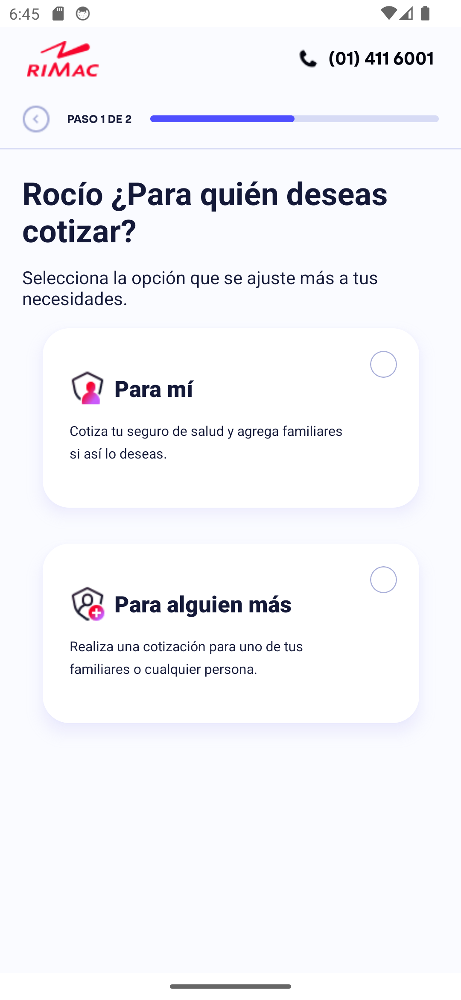
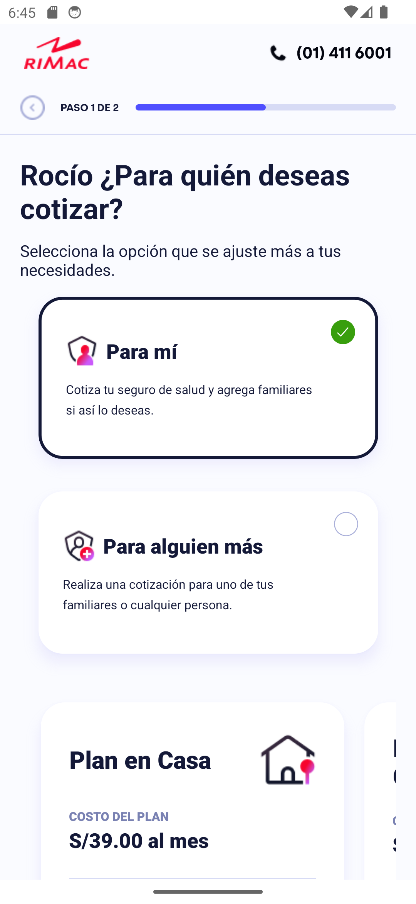
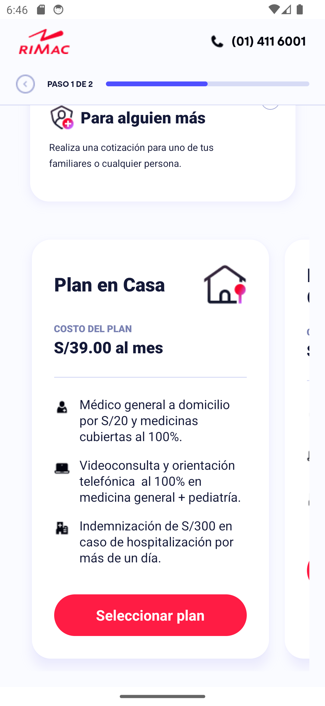
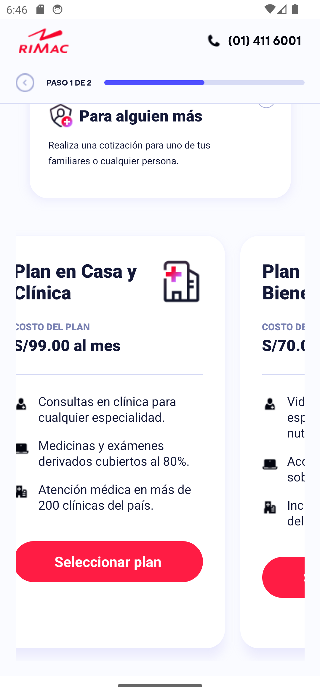
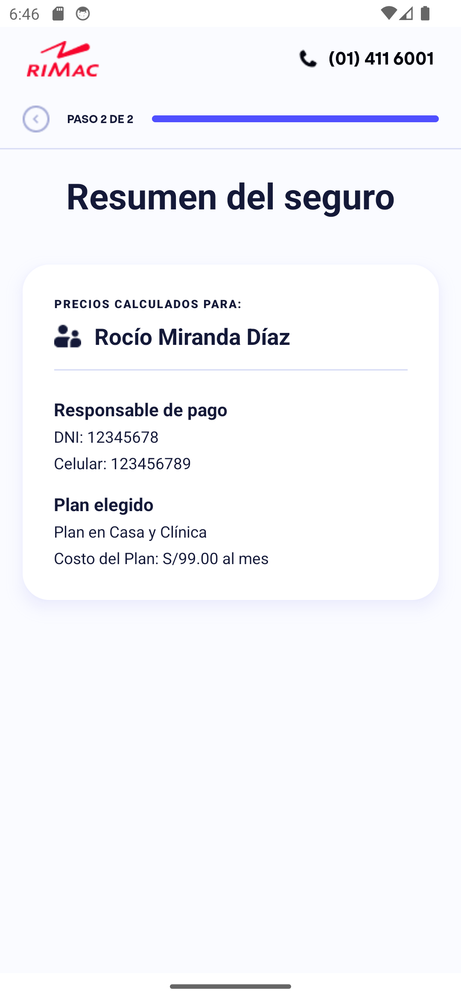

# 🏥 Reto Frontend - Aplicación de Seguros de Salud

Una aplicación móvil desarrollada con **React Native** y **Expo** para la cotización y selección de planes de seguros de salud. Implementa refactorizaciones con principios **SOLID** y testing con Jest.

## 📱 Características Principales

- ✅ **Cotización de seguros** con validación de datos
- ✅ **Formularios avanzados** con React Hook Form
- ✅ **Selección de planes** con interfaz intuitiva
- ✅ **Autenticación segura** con almacenamiento local
- ✅ **Navegación fluida** con Expo Router
- ✅ **Testing** con Jest
- ✅ **Refactorizaciones SOLID** implementadas
- ✅ **TypeScript** para type safety

## 🛠️ Stack Tecnológico

### **Frontend Framework**
- **React Native** `0.81.5` - Framework principal
- **Expo** `~54.0.25` - Plataforma de desarrollo
- **TypeScript** `~5.9.2` - Tipado estático

### **Navegación y Routing**
- **Expo Router** `~6.0.15` - File-based routing
- **React Navigation** `^7.1.8` - Navegación nativa
- **Bottom Tabs** `^7.4.0` - Navegación por pestañas

### **Estado y Contexto**
- **React Context API** - Manejo de estado global
- **React Hook Form** `^7.x` - Gestión avanzada de formularios
- **Custom Hooks** - Lógica reutilizable
- **Expo Secure Store** `^15.0.7` - Almacenamiento seguro

### **HTTP y APIs**
- **Axios** `^1.13.2` - Cliente HTTP para consumo de APIs
- **Custom HTTP Client** - Abstracción con interfaces
- **Error Handling** - Manejo robusto de errores
- **API Integration** - Servicios para planes y usuarios

### **UI/UX**
- **React Native Reanimated** `~4.1.1` - Animaciones
- **Expo Linear Gradient** `^15.0.7` - Gradientes
- **Expo Vector Icons** `^15.0.3` - Iconografía
- **Gesture Handler** `~2.28.0` - Gestos nativos

### **Testing**
- **Jest** `^29.7.0` - Framework de testing

### **Desarrollo**
- **ESLint** `^9.25.0` - Linting de código
- **Expo Dev Tools** - Herramientas de desarrollo

## 🏗️ Arquitectura del Proyecto

```
src/
├── 📁 api/                    # Capa de datos
│   ├── 📁 interfaces/         # Contratos e interfaces
│   ├── 📁 http-client/        # Cliente HTTP abstracto
│   ├── 📁 plans/              # Servicios de planes
│   └── 📁 user/               # Servicios de usuario
├── 📁 services/               # Servicios de negocio
│   ├── auth.service.ts        # Autenticación
│   └── storage.service.ts     # Almacenamiento
├── 📁 di/                     # Dependency Injection
│   └── container.ts           # Contenedor DI
├── 📁 context/                # Contextos React
│   ├── AuthContext.tsx        # Estado de autenticación
│   └── PlansContext.tsx       # Estado de planes
├── 📁 screens/                # Pantallas principales
│   ├── 📁 Cotizar/           # Cotización de seguros
│   ├── 📁 Planes/            # Selección de planes
│   └── 📁 Resumen/           # Resumen de selección
├── 📁 components/             # Componentes reutilizables
│   ├── Header.tsx             # Cabecera de navegación
│   ├── Footer.tsx             # Pie de página
│   └── Stepper.tsx            # Indicador de progreso
├── 📁 app/                    # Routing con Expo Router
└── 📁 __tests__/              # Tests unitarios
```

## 🎯 Principios SOLID Implementados

### **Single Responsibility Principle (SRP)**
- `AuthService`: Solo maneja autenticación
- `StorageService`: Solo maneja almacenamiento
- `PlansService`: Solo maneja datos de planes

### **Open/Closed Principle (OCP)**
- Interfaces permiten extensión sin modificación
- Factory patterns para nuevas implementaciones

### **Liskov Substitution Principle (LSP)**
- `IHttpClient`: Cualquier implementación HTTP es intercambiable
- `IStorageService`: Múltiples proveedores de storage

### **Interface Segregation Principle (ISP)**
- Interfaces específicas por dominio
- No interfaces "gordas" con métodos innecesarios

### **Dependency Inversion Principle (DIP)**
- Servicios dependen de abstracciones
- Dependency Injection Container centralizado

## 🚀 Instalación y Configuración

### **Prerrequisitos**
- Node.js >= 18
- npm o yarn
- Expo CLI / Expo Go
- Android Studio / Xcode (para emuladores)

### **Instalación**

```bash
# Clonar el repositorio
git clone <repository-url>
cd reto-fronted

# Instalar dependencias
npm install

# Iniciar el servidor de desarrollo
npm start
```

### **Scripts Disponibles**

```bash
# Desarrollo
npm start                    # Iniciar Expo dev server
npm run android             # Ejecutar en Android
npm run ios                 # Ejecutar en iOS
npm run web                 # Ejecutar en web

# Testing
npm test                    # Ejecutar tests

# Calidad de código
npm run lint                # Ejecutar ESLint
```

## 🧪 Testing

Implementación de testing unitario con **Jest** para servicios de API y componentes principales.

## 📊 Flujo de la Aplicación

### **1. Cotización (Onboarding)**
- Validación de documento de identidad
- Captura de número telefónico
- Validación de formularios en tiempo real

<div align="center">
  
  
  
</div>

### **2. Selección de Planes**
- Consulta de planes disponibles desde API
- Filtrado por edad y características
- Comparación visual de beneficios

<div align="center">
  
  
  
</div>

<div align="center">
  
  
</div>

### **3. Resumen y Confirmación**
- Resumen de datos ingresados
- Detalles del plan seleccionado
- Confirmación final

## 🔐 Seguridad

- **Expo Secure Store** para datos sensibles
- **Validación de inputs** en frontend
- **Error boundaries** para manejo de errores
- **Type safety** con TypeScript

## 📱 Compatibilidad

Enfocado en **iOS**, **Android** y **Responsive Design** para múltiples dispositivos.

## 🧩 Componentes Reutilizables

### **Componentes Globales**
- **Header** - Cabecera de navegación con título dinámico
- **Footer** - Pie de página con información de la app
- **Stepper** - Indicador de progreso paso a paso

### **Componentes de Formulario**
- **DocumentInput** - Input de documento con validación
- **PhoneInput** - Input de teléfono con formato
- **CotizarForm** - Formulario completo de cotización

### **Componentes de Planes**
- **CardPlan** - Tarjeta individual de plan
- **PlanesCardSlider** - Carrusel de planes con navegación

## 🎨 UI/UX Features

- **Animaciones fluidas** con Reanimated
- **Gestos nativos** optimizados
- **Tema adaptativo** (light/dark)
- **Componentes accesibles**
- **Loading states** y feedback visual

---
